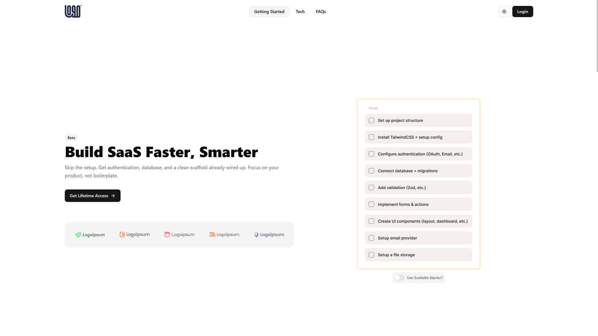

# 🚀 sveltekit starter – homepage  

a **production-ready homepage template** built with **sveltekit + svelte 5 + Shadcn-svelte**.  
perfect for launching your next saas, product, or open-source project — **fast, minimal, and conversion-focused**.  

---

## ✨ features  
✅ **modern stack** – sveltekit, svelte 5 with runes, shadcn-svelte   
✅ **responsive by default** – works on mobile, tablet, desktop  
✅ **minimal + high-converting layout** – proven hero, cta, and section structure  
✅ **seo-friendly** – optimized metadata and clean semantic html  
✅ **dark mode support**  
✅ **ready to customize** – easily adapt text, images, and styles to your brand  

---

## 📸 preview  


---

## 🛠️ tech stack  
- **[sveltekit](https://svelte.dev/docs/kit/introduction)** – framework  
- **[svelte 5](https://svelte.dev/)** – latest reactivity & runes  
- **[tailwindcss 4](https://tailwindcss.com/)** – utility-first styling  
- **[Shadcn-svelte](https://shadcn-svelte.com/)** – modern, accessible ui components

---

## 🚀 getting started  

clone the repo:  
```bash
git clone https://github.com/component-directory/svelte-landing-page-template
cd svelte-landing-page-template
pnpm install
pnpm dev
```

open [http://localhost:5173](http://localhost:5173) in your browser. 🎉  

---

## 💡 use cases  
- saas product landing page  
- open source project homepage  
- startup mvp marketing site  
- personal portfolio  

---

## 🔥 full starterkit  
this homepage is **just one part** of the full **sveltekit starter**.  
the **paid version** includes:  
- 🔑 authentication (email, oauth, sessions)  
- 📦 database setup & crud example  
- 📧 email support (magic links, password reset)  
- 🎨 admin dashboard + modern ui components  
- 📋 example to-do app with full crud  

👉 [check out the full starterkit here](https://component.directory/sveltekit-starter)  

---

## 📜 license  
MIT license – free to use and modify.  

if you like this project, **please star ⭐ the repo** and share it with others!  
